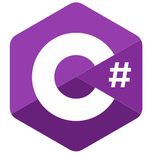

### Hey There 

## I'm Bhaskar, a Passionate Self Taught Developer, Programmer and a Student.

- 🔭 I'm Currently Working on Something Cool 
- 🌱 I’m Currently Learning Ruby and Getting to know about High Frequency Trading.                                                                       
- 🥅 2023 Goals: Contribute More to Open Source Projects.
- ⚡ Fun fact: I Love Playing Basketball and Listening to Music.

### Connect With Me:

[][twitter]
[][linkedin]
[][instagram]

 

### Languages and Tools:

 
 

### 📈 My GitHub Stats:

 

[twitter]: https://twitter.com/bhaskar9980
[instagram]: https://www.instagram.com/bhaskar.1606/
[linkedin]: https://www.linkedin.com/in/bhaskar9980/
